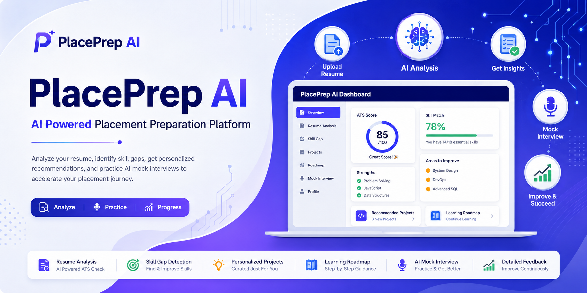

<p align="center">
  
</p>

<h1 align="center">🚀 PlacePrep AI</h1>

<p align="center">
AI Powered Resume Analyzer & Mock Interview Platform
</p>
<p align="center">


</p>
PlacePrep AI is a collaborative full-stack web application designed to help students become placement-ready using Artificial Intelligence.

The platform enables users to upload their resumes, receive an AI-powered ATS analysis, identify missing skills, get personalized project recommendations, and practice AI-generated mock interviews to improve their placement preparation.

---

## ✨ Key Features

- 📄 Resume Upload & PDF Parsing
- 🤖 AI-Powered Resume Analysis using Google Gemini
- 📊 ATS Score Generation
- 🛠 Skill Gap Detection
- 💡 Personalized Project Recommendations
- 🗺 AI Learning Roadmap
- 🎤 AI Mock Interview
- 📈 Interview Evaluation & Feedback
- 💾 MongoDB Database Integration
- 🌐 Fully Deployed Full Stack Application

---

## 🛠 Tech Stack

### 🎨 Frontend

- HTML5
- CSS3
- JavaScript

### ⚙️ Backend

- Node.js
- Express.js

### 🗄 Database

- MongoDB Atlas
- Mongoose

### 🤖 AI

- Google Gemini API

### 🚀 Deployment

- Vercel (Frontend)
- Render (Backend)

### 🧰 Tools & Utilities

- Git
- GitHub
- Postman
- Multer
- PDF-Parse

## 🏗 Project Architecture

```
                    User
                      │
                      ▼
          Frontend (HTML/CSS/JS)
                      │
               REST API Calls
                      │
                      ▼
           Express.js Backend
          ┌──────────┴──────────┐
          ▼                     ▼
   Google Gemini API      MongoDB Atlas
          │                     │
          ▼                     ▼
 Resume Analysis         User & Resume Data
```
## 📂 Folder Structure

```text
PlacePrep
│
├── Backend
│   ├── config
│   ├── controllers
│   ├── models
│   ├── routes
│   ├── services
│   ├── uploads
│   ├── utils
│   ├── .env
│   ├── server.js
│   ├── testGemini.js
│   ├── package.json
│   └── package-lock.json
│
├── Frontend
│   ├── assets
│   ├── css
│   ├── js
│   ├── index.html
│   ├── signup.html
│   ├── dashboard.html
│   ├── resume-upload.html
│   ├── interview.html
│   ├── result.html
│   ├── profile.html
│   ├── loading.html
│   ├── package.json
│   └── package-lock.json
│
├── .gitignore
└── README.md
```

## 📸 Application Preview

### 🔐 Login Page


---

### 📝 Signup Page


---

### 📄 Resume Upload


---

### 🤖 AI Resume Analysis


---

### 🎤 AI Mock Interview


---

### 📊 Interview Feedback


## 🌐 Live Demo

### Frontend
https://place-prep-nu.vercel.app/

### Backend API
https://placeprep-sb9x.onrender.com

## 🔑 Environment Variables

Create a `.env` file inside the Backend folder.

```env
GEMINI_API_KEY=your_gemini_api_key
MONGODB_URI=your_mongodb_uri

```
### 👥 Contributors

### 👩 Yukti Kathuria
- Backend Development
- Google Gemini AI Integration
- MongoDB Integration
- Resume Analysis Logic
- Mock Interview Backend
- Deployment

### 👩 Prachi
- Frontend Development
- UI/UX Design
- Responsive User Interface

## 🚀 Future Scope

- AI Cover Letter Generator
- Job Recommendation System
- Resume Version History
- Company-wise Interview Questions
- AI Career Mentor Chatbot
- Resume Templates
- PDF Report Download
- Progress Tracking Dashboard

## 🎯 Target Users

- College Students
- Fresh Graduates
- Placement Aspirants
- Internship Seekers

## ⚙️ Installation

### Clone Repository

```bash
git clone https://github.com/yuktik2704-dot/PlacePrep.git
```

### Backend

```bash
cd Backend
npm install
npm start
```

### Frontend

Open `index.html` in your browser or run using Live Server.


## 📜 License

This project is intended for educational and placement preparation purposes.


## 💙 Developed By

Yukti Kathuria

ECE-AI | IGDTUW

Backend Developer | AI Enthusiast

With Frontend & UI/UX contributions by Prachi.